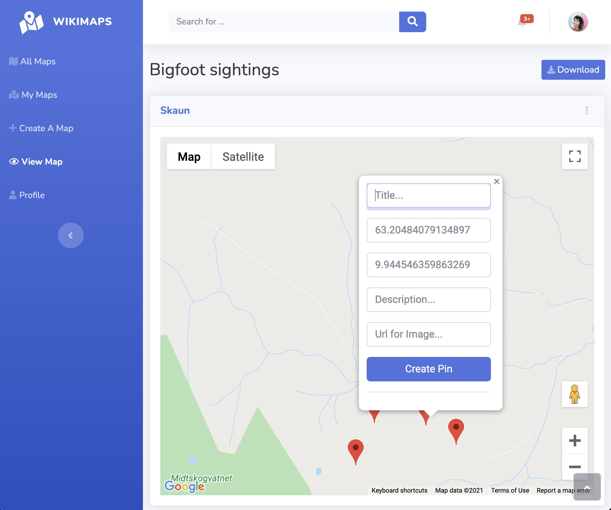
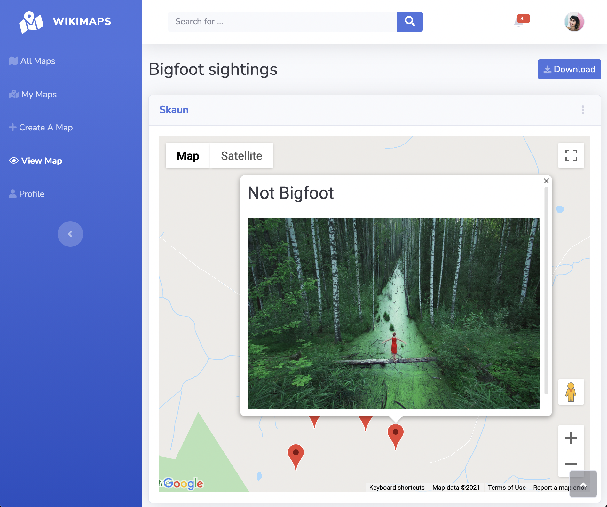
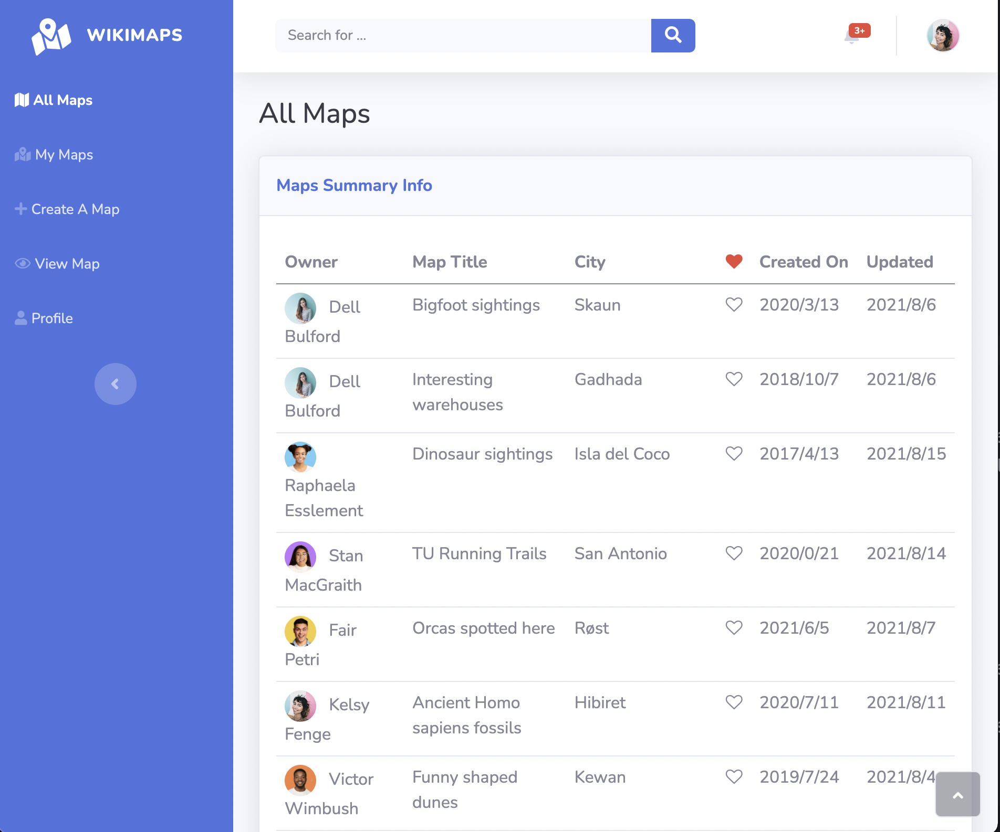
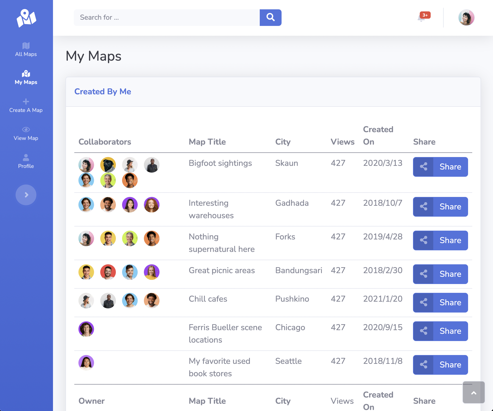
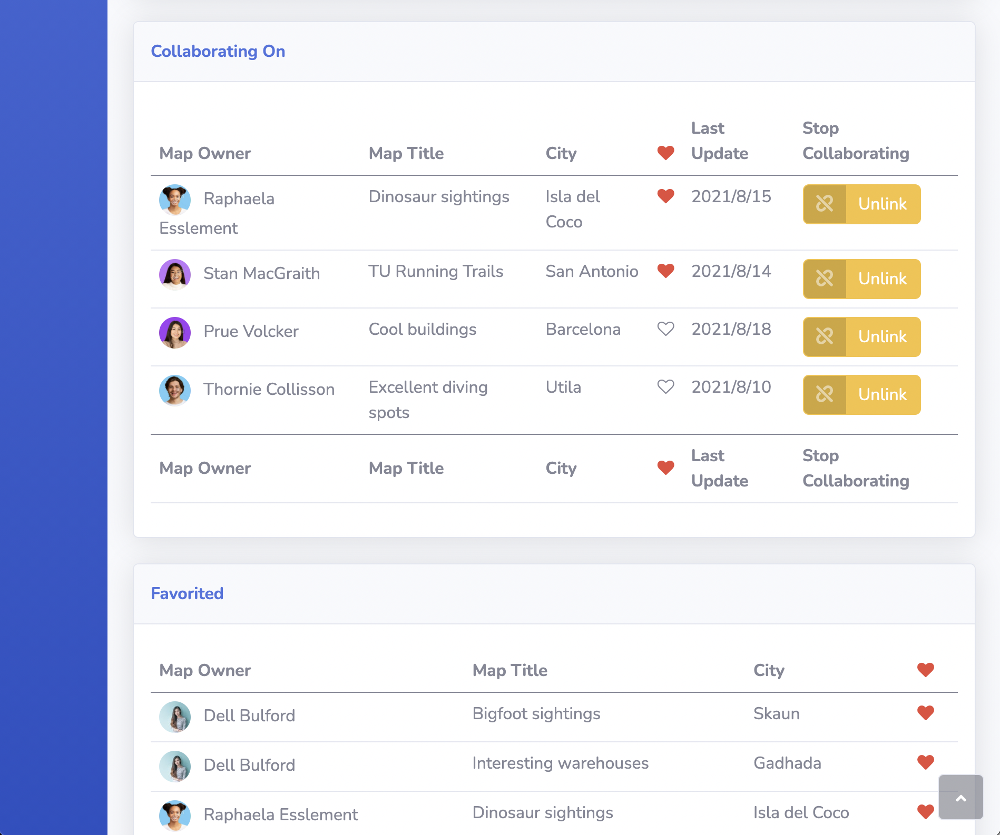

Wikimaps
=========

## Project Summary
Wikimaps is a platform where users can create shared maps. 

## Screenshots
### Add A Pin To Map

### Pin Information

### All Maps

### Maps Created By You

### Maps You Are Collaborating On

## Getting Started

1. Create the `.env` by using `.env.example` as a reference: `cp .env.example .env`
2. Update the .env file with your correct local information, for example 
  - username: `mapper` 
  - password: `mapper` 
  - database: `wikimaps`
3. Install dependencies: `npm i`
4. Fix to binaries for sass: `npm rebuild node-sass`
5. Reset database: `npm run db:reset`
  - Check the db folder to see what gets created and seeded in the SDB
7. Run the server: `npm run local`
  - Note: nodemon is used, so you should not have to restart your server
8. Visit `http://localhost:8080/`

## Warnings & Tips

- Do not edit the `layout.css` file directly, it is auto-generated by `layout.scss`
- Split routes into their own resource-based file names, as demonstrated with `users.js` and `widgets.js`
- Split database schema (table definitions) and seeds (inserts) into separate files, one per table. See `db` folder for pre-populated examples. 
- Use the `npm run db:reset` command each time there is a change to the database schema or seeds. 
  - It runs through each of the files, in order, and executes them against the database. 
  - Note: you will lose all newly created (test) data each time this is run, since the schema files will tend to `DROP` the tables and recreate them.

## Dependencies

- Node 10.x or above
- NPM 5.x or above
- PG 6.x
